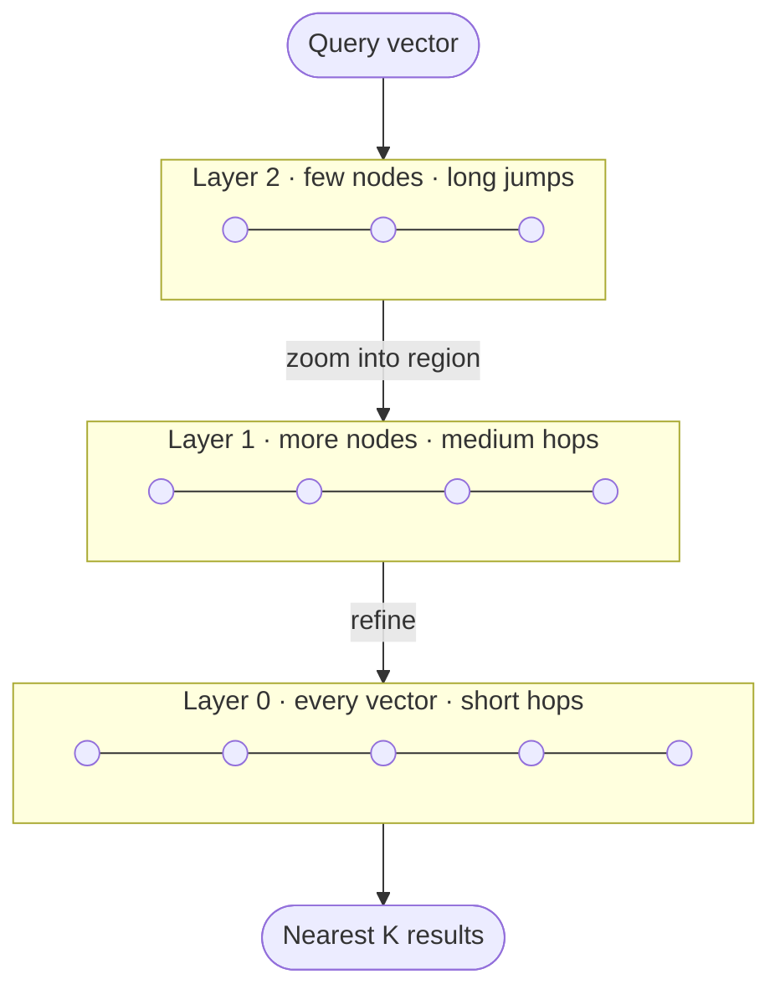

# GoVecDB

An embeddable **vector database in pure Go** — no CGO, no dependencies. Stores
embeddings and answers *"what is most similar to this?"* using an HNSW
approximate-nearest-neighbor index.

[](https://golang.org)
[](LICENSE)

> ## ⚠️ Status: v1 rebuild in progress
>
> This branch (`v1-restructure`) is a **ground-up rewrite**. The previous
> implementation — ~45,700 lines covering clustering, gRPC, REST, segments and
> several competing index variants — has been removed from the working tree. It
> remains in git history on `main` and is recoverable at any time.
>
> **What exists today:** `internal/hnsw` — a complete, tested, benchmarked HNSW
> index (1,075 lines). That is the entire codebase.
>
> **What does not exist yet:** the public API, persistence, compaction.
> There is no importable package yet — `internal/` is not consumable from outside
> the module. See [the roadmap](docs/MIGRATION.md).

## What GoVecDB is for

AI models turn text, images, and audio into **embeddings** — lists of numbers where
*things that mean similar things sit close together* in number-space. That reframes
"find me content similar to this" into a geometry problem: **find the stored vectors
nearest to my query vector** (nearest-neighbor search).

The naive approach — compare the query against *every* stored vector — is `O(N)` and
collapses at millions of vectors. GoVecDB's purpose is to make that search fast and
durable, in pure Go so it stays embeddable:

> Store millions of embeddings and answer *"what's most similar to this?"* in
> sub-millisecond time, and survive crashes.

This powers **semantic search**, **RAG** for LLMs, **recommendations**, and
**anomaly detection**.

## How it works

### The core trick: HNSW (skip brute force)

Instead of scanning every vector, GoVecDB builds a **hierarchical graph** (HNSW —
Hierarchical Navigable Small World). Think of finding a house in a country: you don't
knock on every door — you take highways to the right region, then regional roads, then
local streets. HNSW searches the same way, turning `O(N)` into roughly `O(log N)`.



A search **enters at the sparse top layer, takes big jumps toward the right region,
then drops layer by layer taking smaller steps** until it lands among the true nearest
neighbors — visiting only a tiny fraction of all vectors. Two knobs trade speed for
accuracy: `M` (connections per node) and `EfConstruction`/`ef` (how wide the search
explores).

For the design decisions behind the implementation — why vectors are normalized on
insert, why neighbor selection is alpha-pruned, how the search path reaches two
allocations — see [`internal/hnsw/README.md`](internal/hnsw/README.md).

## Current API

`internal/hnsw` is internal, so this is not importable yet; it is what the public
API will be built on top of.

```go
g, _ := hnsw.New(hnsw.DefaultConfig(128, hnsw.Cosine))
_ = g.Insert("doc1", vec1)
_ = g.Insert("doc1", vec2) // upsert: same id, new vector replaces the old

results, _ := g.Search(query, 10 /*k*/, 64 /*ef*/)
for _, r := range results {
    fmt.Println(r.ID, r.Distance) // ascending; smaller = closer
}

g.Delete("doc1") // tombstone; the slot keeps routing, never answers
```

| Knob | Where | Adaptable? |
|------|-------|-----------|
| `M` — neighbors per node (layers > 0; layer 0 uses `2*M`) | `Config`, set once | **No** — structural; changing it means rebuilding |
| `EfConstruction` — search width during inserts | `Config` | Kept fixed (100–200) |
| `Alpha` — pruning relaxation | `Config` | Fixed per graph; 1.0–1.4 useful, default 1.2 |
| `ef` — search width at query time | `Search(query, k, ef)` | **Yes** — per query; auto-clamped to `>= k` |

## Measured performance

Apple M4 Max, 10k vectors × 128 dim, k=10, ef=64:

| Metric | Value |
|---|---|
| Search | 105,141 ns/op |
| Search allocations | **2 allocs/op**, 1,264 B/op |
| Cosine distance (normalized) | 30.1 ns, 0 allocs |
| Euclidean distance | 25.9 ns, 0 allocs |
| Recall@10 (dim 32) | **0.999** |
| Recall@10 (dim 768) | **0.972** |

Recall is measured against brute-force ground truth in `graph_test.go`, not estimated.

## Roadmap

1. ~~**HNSW index**~~ — done, from scratch, tested against brute force
2. ~~**Concurrent reads**~~ — done; pooled search scratch + `RWMutex`, parallel `Search`
3. ~~**Delete**~~ — done; tombstones that keep routing, filtered out of results
4. ~~**Upsert**~~ — done; `Insert` replaces an existing id, tombstoning the old slot
5. **Compaction** — rebuild the graph to reclaim slots left by deletes and updates
6. **WAL** — write-ahead log; write to WAL first, then apply to the in-memory graph
7. **Snapshots + recovery** — replay the WAL to rebuild the graph (the graph is derived state)
8. **Public API** — `vector.go` / `db.go` / `options.go` facade over the internals
9. **Metadata filtering**

Out of scope for v1 (returns in v2): clustering, REST/gRPC servers, quantization.

## Development

```bash
go build ./...
go vet ./...
go test ./... -race
```

```bash
go test ./internal/hnsw/ -run='^$' -bench=. -benchmem
```

Requires Go 1.24+. The module has **zero third-party dependencies** — `go.mod` has no
`require` block, and there is no `go.sum`. Keep it that way.

## Contributing

See [CONTRIBUTING.md](CONTRIBUTING.md). Note that during the v1 rebuild the codebase
is changing shape quickly; open an issue before starting substantial work.

## License

MIT — see [LICENSE](LICENSE).
