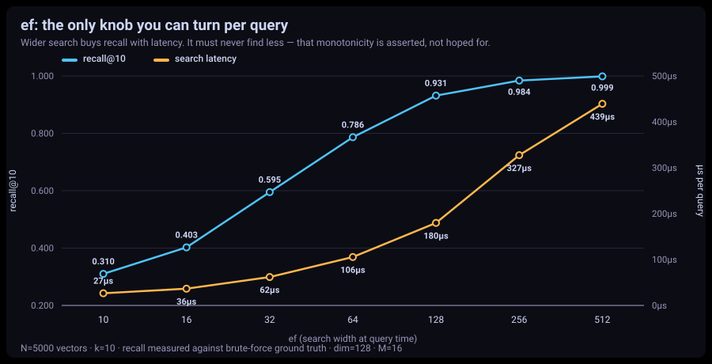
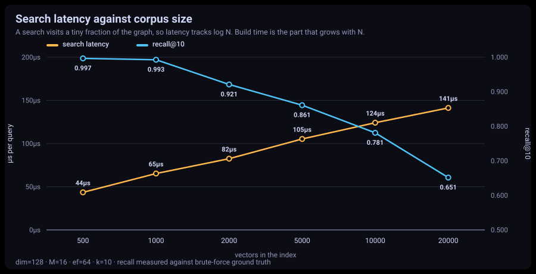
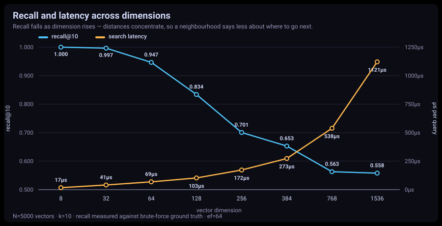
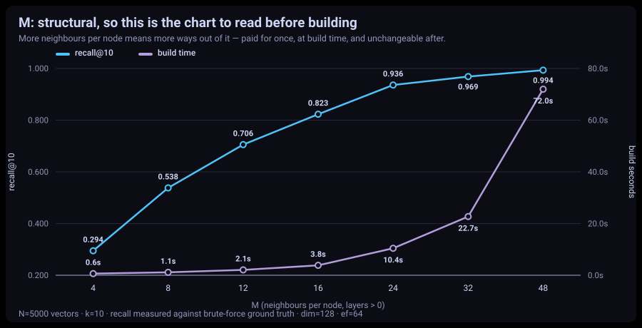
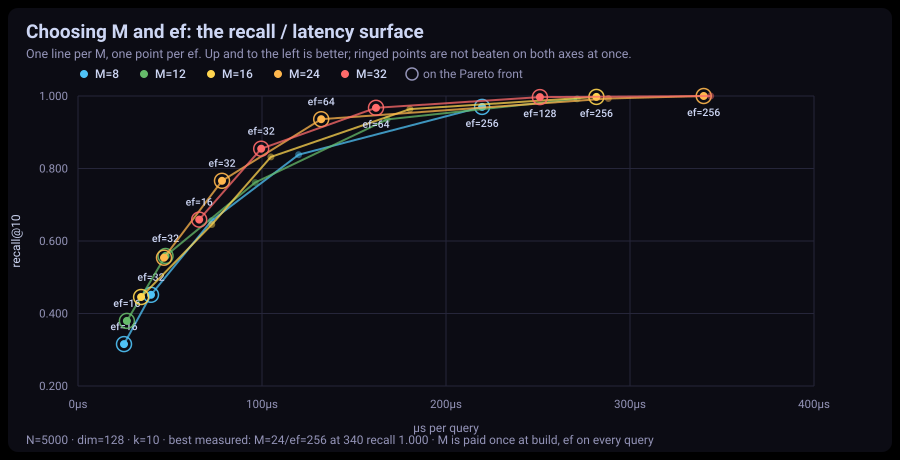
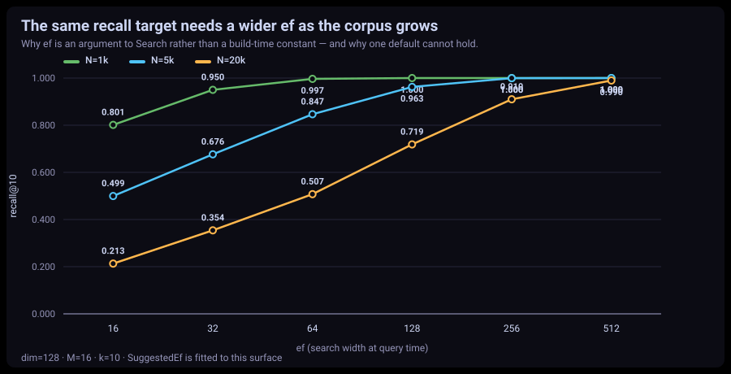
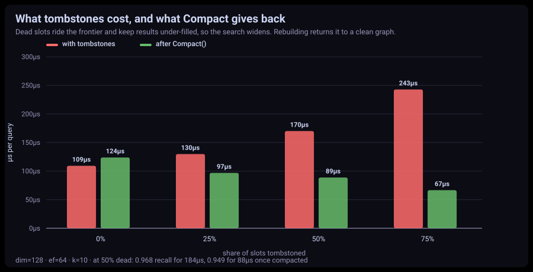

# GoVecDB

An embeddable **vector database in pure Go** — no CGO, no dependencies. Stores
embeddings and answers *"what is most similar to this?"* using an HNSW
approximate-nearest-neighbor index.

[](https://golang.org)
[](LICENSE)

> ## ⚠️ Status: v1 rebuild in progress
>
> This branch (`v1-restructure`) is a **ground-up rewrite**. The previous
> implementation — ~45,700 lines covering clustering, gRPC, REST, segments and
> several competing index variants — has been removed from the working tree. It
> remains in git history on `main` and is recoverable at any time.
>
> **What exists today:** `internal/hnsw` — a complete, tested, benchmarked HNSW
> index (1,075 lines). That is the entire codebase.
>
> **What does not exist yet:** the public API, persistence, compaction.
> There is no importable package yet — `internal/` is not consumable from outside
> the module. See [the roadmap](docs/MIGRATION.md).

## What GoVecDB is for

AI models turn text, images, and audio into **embeddings** — lists of numbers where
*things that mean similar things sit close together* in number-space. That reframes
"find me content similar to this" into a geometry problem: **find the stored vectors
nearest to my query vector** (nearest-neighbor search).

The naive approach — compare the query against *every* stored vector — is `O(N)` and
collapses at millions of vectors. GoVecDB's purpose is to make that search fast and
durable, in pure Go so it stays embeddable:

> Store millions of embeddings and answer *"what's most similar to this?"* in
> sub-millisecond time, and survive crashes.

This powers **semantic search**, **RAG** for LLMs, **recommendations**, and
**anomaly detection**.

## How it works

### The core trick: HNSW (skip brute force)

Instead of scanning every vector, GoVecDB builds a **hierarchical graph** (HNSW —
Hierarchical Navigable Small World). Think of finding a house in a country: you don't
knock on every door — you take highways to the right region, then regional roads, then
local streets. HNSW searches the same way, turning `O(N)` into roughly `O(log N)`.


A search **enters at the sparse top layer, takes big jumps toward the right region,
then drops layer by layer taking smaller steps** until it lands among the true nearest
neighbors — visiting only a tiny fraction of all vectors. Two knobs trade speed for
accuracy: `M` (connections per node) and `EfConstruction`/`ef` (how wide the search
explores).

For the design decisions behind the implementation — why vectors are normalized on
insert, why neighbor selection is alpha-pruned, how the search path reaches two
allocations — see [`internal/hnsw/README.md`](internal/hnsw/README.md).

## Current API

`internal/hnsw` is internal, so this is not importable yet; it is what the public
API will be built on top of.

```go
g, _ := hnsw.New(hnsw.DefaultConfig(128, hnsw.Cosine))
_ = g.Insert("doc1", vec1)
_ = g.Insert("doc1", vec2) // upsert: same id, new vector replaces the old

// ef must grow with the corpus; SuggestedEf fits the measured curve.
ef := g.SuggestedEf(10 /*k*/, 0.95 /*target recall*/)
results, _ := g.Search(query, 10 /*k*/, ef)
for _, r := range results {
    fmt.Println(r.ID, r.Distance) // ascending; smaller = closer
}

g.Delete("doc1") // tombstone; the slot keeps routing, never answers

if g.Stats().DeadRatio() > 0.5 {
    g.Compact() // rebuild over the live vectors; stop-the-world
}
```

| Knob | Where | Adaptable? |
|------|-------|-----------|
| `M` — neighbors per node (layers > 0; layer 0 uses `2*M`) | `Config`, set once | **No** — structural; changing it means rebuilding |
| `EfConstruction` — search width during inserts | `Config` | Kept fixed (100–200) |
| `Alpha` — pruning relaxation | `Config` | Fixed per graph; 1.0–1.4 useful, default 1.2 |
| `ef` — search width at query time | `Search(query, k, ef)` | **Yes** — per query; auto-clamped to `>= k`. Grows with `N` — use `SuggestedEf`, [see the charts](#measured-behaviour) |

## Measured performance

Apple M4 Max, 10k vectors × 128 dim, k=10, ef=64:

| Metric | Value |
|---|---|
| Search | 105,141 ns/op |
| Search allocations | **2 allocs/op**, 1,264 B/op |
| Cosine distance (normalized) | 30.1 ns, 0 allocs |
| Euclidean distance | 25.9 ns, 0 allocs |
| Recall@10 (dim 32) | **0.999** |
| Recall@10 (dim 768) | **0.972** |

Recall is measured against brute-force ground truth in `graph_test.go`, not estimated.

## Measured behaviour

Every chart below is generated from [`docs/benchmarks/results.csv`](docs/benchmarks/results.csv),
which is written by the same tests CI runs — there is no separate benchmarking
script whose numbers can drift from the ones the suite defends. Reproduce with:

```bash
go test ./internal/hnsw/ -run TestSweep -results docs/benchmarks/results.csv -timeout 40m && go run docs/benchmarks/plot.go
```

Apple M4 Max · 5,000 vectors · k=10 · recall against brute-force ground truth.

### `ef` is the knob, and its default is a starting point — not a setting



`ef` is the search width, the one parameter you can change per query. At 5,000
vectors of 128 dimensions it spans **0.310 recall at 27 µs** to **0.999 at
438 µs**. The suite asserts the shape as well as the numbers: a wider search may
cost more, but it must never find *less*.

### Recall at a fixed `ef` falls as the corpus grows



This is the most practically useful thing in this README. Hold `ef` at 64 and
recall slides from 0.997 at 500 vectors to **0.652 at 20,000** — not because the
index degrades, but because a fixed-width beam covers a shrinking share of a
growing space. **`ef` has to grow with `N`.** That it is a `Search` argument
rather than a build-time constant is the whole point.

Latency, meanwhile, grows **3.2× for a 40× corpus** — the sub-linear behaviour
the index exists for. (Even that overstates it: past ~4 MB of vectors the
distance kernels start paying for memory rather than arithmetic, so the measured
curve is nearer `sqrt(N)` than the `log(N)` the algorithm implies.)

### Dimension costs recall and latency at both ends



At `ef=64`, recall runs from 1.000 at 8 dimensions to **0.558 at 1536** while a
query goes from 17 µs to 1,090 µs. High-dimensional embeddings need a wider `ef`,
and the build cost rises with them: the same corpus takes 0.65 s to index at 8
dimensions and 56 s at 1536.

### `M` is structural — read this chart before you build



`M` cannot be changed without rebuilding, and it buys recall at a steep build
price: **M=4 gives 0.294 recall for a 0.6 s build; M=48 gives 0.994 for 73 s.**
The default of 16 sits where the curve turns.

### Choosing `M` and `ef` together



The two charts above each vary one knob with the other at its default, which
shows a slope but cannot answer *"which pair?"* — "M=16 gives 0.823" really means
"M=16 *at a narrow ef*". This is the surface: one line per `M`, one point per
`ef`, ringed where nothing beats that point on both axes at once.

Compared at **equal recall**, raising `M` is worth less than the M-chart alone
suggests:

| Target | via `ef` (M=16) | via `M` (ef=64/128) | Build cost |
|---|---|---|---|
| ~0.96 | ef=128 → 0.964, **180 µs** | M=32/ef=64 → 0.968, **162 µs** | 3.8 s → 23 s |
| ~0.997 | ef=256 → 0.998, **282 µs** | M=32/ef=128 → 0.997, **251 µs** | 3.8 s → 23 s |

**About 10% latency, for 6× the build time and roughly double the graph memory.**
That is a much weaker case for raising `M` than comparing the two 1-D charts
implies — which is exactly why the 2-D grid is the one to read. `M=16` is a good
default; reach for `M=24`–`32` only when query latency is the binding constraint
and you can afford the build.

### Picking `ef` without a benchmark: `SuggestedEf`



Holding a recall target needs a wider search as the corpus grows — measured,
`ef` scales as roughly **n^0.78**. That relationship is fitted into the API so
the guidance lives where it is used:

```go
ef := g.SuggestedEf(10 /*k*/, 0.95 /*target recall*/)
results, _ := g.Search(query, 10, ef)
```

`targetRecall` is a **floor to clear, not a point to hit** — the calibration
carries margin, so 0.95 measures 0.969 at 1,000 vectors and 0.972 at 5,000.
Calibrated exactly on the sweep it undershot on three of four verification
corpora, because recall on one corpus does not transfer precisely to another.

It is a starting point, not a guarantee: calibrated on uniform random 128-dim
vectors at M=16, which is the pessimistic case. `TestSuggestedEfAchievesTarget`
builds real graphs and fails if a suggestion misses, so the constants cannot rot
quietly.

### Tombstones, and what `Compact()` gives back



Dead slots ride the search frontier, so latency climbs with them — 104 µs clean,
**243 µs at 75% tombstoned**, back to **69 µs** after `Compact()`.

There is a subtlety worth knowing, because it looks like a regression and isn't:
compaction *slightly lowers* recall (0.968 → 0.949 at 50% dead). Tombstones keep
the result set under-filled, which loosens the pruning bound and makes the search
explore wider than `ef` asked for. That bought recall nobody requested at a
latency nobody wanted — 184 µs against 88 µs. A marginally larger `ef` on the
compacted graph recovers the recall and is still twice as fast.

### Metric and data shape

| Metric | recall @ ef=64 | @ ef=256 | | Corpus | recall | latency |
|---|---|---|---|---|---|---|
| Cosine | 0.830 | 0.998 | | centered | 0.852 | 120 µs |
| Euclidean | 0.820 | 0.980 | | positive orthant | 0.865 | 90 µs |
| DotProduct | 0.848 | 0.999 | | clustered | 0.884 | 38 µs |

All three metrics behave alike — no metric is weak here, and a wide search
recovers every one of them, which is what rules out the graph rather than the
data being at fault. Clustered data, which is what real embeddings look like, is
**3× faster** to search than uniform noise.

## Roadmap

1. ~~**HNSW index**~~ — done, from scratch, tested against brute force
2. ~~**Concurrent reads**~~ — done; pooled search scratch + `RWMutex`, parallel `Search`
3. ~~**Delete**~~ — done; tombstones that keep routing, filtered out of results
4. ~~**Upsert**~~ — done; `Insert` replaces an existing id, tombstoning the old slot
5. ~~**Compaction**~~ — done; `Compact()` rebuilds over the live vectors and swaps in
6. **WAL** — write-ahead log; write to WAL first, then apply to the in-memory graph
7. **Snapshots + recovery** — replay the WAL to rebuild the graph (the graph is derived state)
8. **Public API** — `vector.go` / `db.go` / `options.go` facade over the internals
9. **Metadata filtering**

Out of scope for v1 (returns in v2): clustering, REST/gRPC servers, quantization.

## Development

```bash
go build ./...
go vet ./...
go test ./... -race
```

```bash
go test ./internal/hnsw/ -run='^$' -bench=. -benchmem
```

Requires Go 1.24+. The module has **zero third-party dependencies** — `go.mod` has no
`require` block, and there is no `go.sum`. Keep it that way.

## Contributing

See [CONTRIBUTING.md](CONTRIBUTING.md). Note that during the v1 rebuild the codebase
is changing shape quickly; open an issue before starting substantial work.

## License

MIT — see [LICENSE](LICENSE).
