<p align="center">
  
</p>

<h1 align="center">GoVecDB</h1>

<p align="center">
  An embeddable <b>vector database in pure Go</b> — no CGO, no dependencies.<br>
  Stores embeddings and answers <i>“what is most similar to this?”</i><br>
  using an HNSW approximate-nearest-neighbor index.
</p>

<p align="center">
  <a href="https://github.com/khambampati-subhash/govecdb/actions/workflows/ci.yml"></a>
  <a href="https://pkg.go.dev/github.com/khambampati-subhash/govecdb"></a>
  <a href="https://goreportcard.com/report/github.com/khambampati-subhash/govecdb"></a>
  <a href="https://golang.org"></a>
  <a href="LICENSE"></a>
</p>

> The mark is *Glaucus atlanticus*, the blue dragon sea slug. Its cerata fan out
> from the body the way edges radiate from a node in a navigable graph — which is
> what an HNSW index is.

```go
db, _ := govecdb.Open("data", govecdb.WithDimension(768))
defer db.Close()

db.Add(govecdb.Vector{ID: "doc-1", Values: embedding})
matches, _ := db.Search(govecdb.SearchRequest{Query: query, K: 10})
```

## Status

**v1.3.0 — released and usable, as a library or as a server.** `govecdb.Open`
gives you add, get, delete, search, filter, enumerate, snapshot and compact over
one directory, durable through a write-ahead log and recoverable from snapshots.
Batch writes and recovery build the index on every core, and everything the
database does on its own is reported through one observer. `cmd/govecdbd` serves
a directory of collections over HTTP, and adds no dependencies doing it.

GoVecDB was rewritten from the ground up; the previous ~45,700-line
implementation remains in git history. See [the record](docs/MIGRATION.md) for
what was built and why, and [the changelog](CHANGELOG.md) for what is in this
release.

### Stability and compatibility

- **The public API is covered by semver.** Everything exported from the root
  package is additive from here — a breaking change would force the import path
  to `.../govecdb/v2`, which is not something to do casually.
- **`internal/` is not part of that promise**, and cannot be imported from
  outside the module. That is where the design still has room to move.
- **The on-disk formats are versioned and frozen.** The WAL record header, the
  snapshot framing and the graph codec each have a frozen-layout test guarding
  them (`TestLayoutIsFrozen`, `TestCodecLayoutIsFrozen`), so a v1.x release will
  read a v1.0 directory.

### Known limitations

Worth knowing before you adopt it, rather than after:

| | |
|---|---|
| **Linux and macOS only** | The log and snapshot store fsync the containing *directory*, which is not portable to Windows. Untested there. |
| **`Compact()` stops the world** | It holds the write lock for a full rebuild. You choose the moment; the database never triggers it. |
| **Writers serialize** | Reads scale across cores. Separate writes do not; one `AddBatch` links its vectors on every core (`WithInsertWorkers`), and so does log replay. |
| **One database is one index** | Many indexes in one process means [running it as a service](docs/SERVICE.md); the library itself is still one directory, one index. |
| **Selective filters approach a scan** | Past roughly one vector in a hundred, scanning the metadata is the better tool. |
| **The service is a single process** | No clustering, no replication. [v2 item 8](docs/MIGRATION.md#v2-scope). |

Still out of scope and planned for [v2](docs/MIGRATION.md#v2-scope): clustering,
gRPC, quantization, and online compaction. See
[durability and latency](docs/DURABILITY.md) for what is guaranteed today and
what it costs.

## Install

Requires **Go 1.24+**.

```bash
go get github.com/khambampati-subhash/govecdb
```

That is the whole installation. No CGO toolchain, and no third-party packages
come with it — GoVecDB is a library that stores its data in a directory you
choose.

If you would rather run it as a server, there is one in the box:

```bash
go install github.com/khambampati-subhash/govecdb/cmd/govecdbd@latest
govecdbd -dir ./data
```

Still no dependencies: it is `net/http` and `encoding/json`. See
[**running it as a service**](docs/SERVICE.md).

## Quick start

A complete program. Save it as `main.go`, `go mod tidy`, `go run .`:

```go
package main

import (
	"fmt"
	"log"

	"github.com/khambampati-subhash/govecdb"
)

func main() {
	// Creates ./data if it does not exist. Dimension is required — it is
	// structural, and reopening with a different one is refused.
	db, err := govecdb.Open("data", govecdb.WithDimension(4))
	if err != nil {
		log.Fatal(err)
	}
	defer db.Close()

	// Metadata values must be string, bool, int64 or float64.
	// Note int64(12), not 12 — an untyped constant is an int, and Add says so
	// rather than guessing.
	err = db.AddBatch([]govecdb.Vector{
		{ID: "cat", Values: []float32{1, 0, 0, 0}, Metadata: govecdb.Metadata{"kind": "animal"}},
		{ID: "dog", Values: []float32{0.9, 0.1, 0, 0}, Metadata: govecdb.Metadata{"kind": "animal"}},
		{ID: "car", Values: []float32{0, 0, 1, 0}, Metadata: govecdb.Metadata{"kind": "vehicle"}},
	})
	if err != nil {
		log.Fatal(err)
	}

	matches, err := db.Search(govecdb.SearchRequest{
		Query: []float32{1, 0, 0, 0},
		K:     2,
	})
	if err != nil {
		log.Fatal(err)
	}
	for _, m := range matches {
		// Distance is "smaller = closer" whatever the metric.
		fmt.Printf("%-4s  %.4f  %v\n", m.ID, m.Distance, m.Metadata)
	}

	// Bounds how long the next start takes. Without one, reopening replays the
	// whole log; with one, it loads a graph.
	if err := db.Snapshot(); err != nil {
		log.Fatal(err)
	}
}
```

Run it twice — the second run finds the data still there, because every write
went to a write-ahead log before it reached the index.

Searches can be restricted by metadata:

```go
matches, err := db.Search(govecdb.SearchRequest{
    Query:  query,
    K:      10,
    Filter: govecdb.And(
        govecdb.Eq("source", "handbook.pdf"),
        govecdb.Gte("page", 10),
        govecdb.Not(govecdb.Exists("retracted")),
    ),
})
```

The filter runs *during* the graph traversal, not over the results — so you get
10 matching vectors rather than however many of the nearest 10 happened to match.
[See what that costs.](#filtering-costs-search-width-not-allocations)

Leaving `Ef` zero lets the search width be chosen from the corpus size, which is
what keeps recall steady as the database grows — recall at a *fixed* width falls
as a corpus gets bigger, so any constant you pick today is wrong later.

Durability is a knob and the zero value is the safe one: `SyncAlways` means an
acknowledged write has survived power loss, at roughly 4 ms each.
`WithSyncPolicy(govecdb.SyncInterval)` makes the append ~4,000× cheaper — 8.8× end
to end, because indexing then dominates — and loses up to one interval to a crash. See [durability and latency](docs/DURABILITY.md).

Nothing snapshots automatically. Call `db.Snapshot()`, or set
`WithSnapshotInterval` — without one, a restart replays the whole log and rebuilds
the index at ~500 µs of CPU per vector (spread across cores); with one, it loads
a graph at gigabytes per second.

## Or run it as a service

Embedding it is the fast path — a search is microseconds of in-memory work and a
network hop is not. When the clients are not one Go program, `cmd/govecdbd`
serves a directory of **collections** over HTTP:

```bash
govecdbd -dir ./data      # or: docker build -t govecdb . && docker run -p 8080:8080 -v data:/data govecdb
```

```bash
curl -sX POST localhost:8080/v1/collections -H 'Content-Type: application/json' \
  -d '{"name": "docs", "dimension": 768, "metric": "cosine"}'

curl -sX POST localhost:8080/v1/collections/docs/vectors -H 'Content-Type: application/json' \
  -d '{"vectors": [{"id": "doc-1", "values": [...], "metadata": {"page": 3}}]}'

curl -sX POST localhost:8080/v1/collections/docs/search -H 'Content-Type: application/json' \
  -d '{"query": [...], "k": 10,
       "filter": {"op": "gte", "key": "page", "value": 2}}'
```

Each collection is an independent database — its own dimension, metric and
durability policy — created at runtime, loaded on demand, and evictable when
idle. The API is `net/http` and `encoding/json`, so the **zero-dependency
guarantee is unchanged**: `go.mod` still has no `require` block.

Health probes, Prometheus metrics, a bearer token, TLS, and a graceful shutdown
that drains before it cuts. Full guide: [**running it as a
service**](docs/SERVICE.md).

> gRPC and clustering are *not* here, and when they come they will be a separate
> module — neither gRPC nor Raft is standard library, and this one keeps its
> guarantee. That decision was made before the server was written rather than
> discovered afterwards; the reasoning is
> [written down](docs/SERVICE.md#the-module-decision).

## What GoVecDB is for

AI models turn text, images, and audio into **embeddings** — lists of numbers where
*things that mean similar things sit close together* in number-space. That reframes
"find me content similar to this" into a geometry problem: **find the stored vectors
nearest to my query vector** (nearest-neighbor search).

The naive approach — compare the query against *every* stored vector — is `O(N)` and
collapses at millions of vectors. GoVecDB's purpose is to make that search fast and
durable, in pure Go so it stays embeddable:

> Store millions of embeddings and answer *"what's most similar to this?"* in
> sub-millisecond time, and survive crashes.

This powers **semantic search**, **RAG** for LLMs, **recommendations**, and
**anomaly detection**.

## How it works

### The core trick: HNSW (skip brute force)

Instead of scanning every vector, GoVecDB builds a **hierarchical graph** (HNSW —
Hierarchical Navigable Small World). Think of finding a house in a country: you don't
knock on every door — you take highways to the right region, then regional roads, then
local streets. HNSW searches the same way, turning `O(N)` into roughly `O(log N)`.

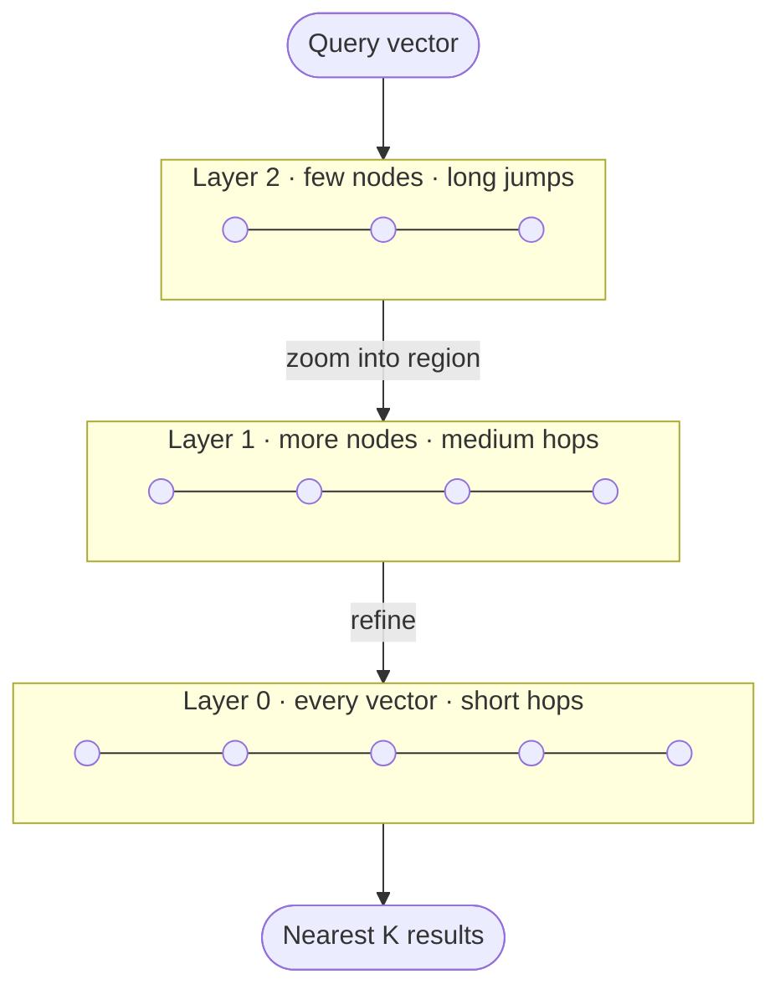
```mermaid
flowchart TB
    Q([Query vector]) --> TOP

    subgraph TOP [Layer 2 · few nodes · long jumps]
        direction LR
        n1(( )) --- n2(( )) --- n3(( ))
    end
    subgraph MID [Layer 1 · more nodes · medium hops]
        direction LR
        m1(( )) --- m2(( )) --- m3(( )) --- m4(( ))
    end
    subgraph BOT [Layer 0 · every vector · short hops]
        direction LR
        b1(( )) --- b2(( )) --- b3(( )) --- b4(( )) --- b5(( ))
    end

    TOP -->|zoom into region| MID
    MID -->|refine| BOT
    BOT --> R([Nearest K results])
```

A search **enters at the sparse top layer, takes big jumps toward the right region,
then drops layer by layer taking smaller steps** until it lands among the true nearest
neighbors — visiting only a tiny fraction of all vectors. Two knobs trade speed for
accuracy: `M` (connections per node) and `EfConstruction`/`ef` (how wide the search
explores).

For the design decisions behind the implementation — why vectors are normalized on
insert, why neighbor selection is alpha-pruned, how the search path reaches one
allocation, how a batch is linked on many cores — see [`internal/hnsw/README.md`](internal/hnsw/README.md).

## The API

```go
import "github.com/khambampati-subhash/govecdb"

db, _ := govecdb.Open("data", govecdb.WithDimension(128))
defer db.Close()

_ = db.Add(govecdb.Vector{ID: "doc1", Values: v1, Metadata: govecdb.Metadata{
    "source": "handbook.pdf",
    "page":   int64(12),
}})
_ = db.Add(govecdb.Vector{ID: "doc1", Values: v2}) // upsert: same id, new vector

// Ef defaults to a width chosen from the corpus size — see SuggestedEf below.
matches, _ := db.Search(govecdb.SearchRequest{Query: query, K: 10})
for _, m := range matches {
    fmt.Println(m.ID, m.Distance, m.Metadata) // ascending; smaller = closer
}

_ = db.Delete("doc1") // tombstone; the slot keeps routing, never answers

_ = db.Snapshot() // bounds restart time, and truncates the log behind it

if db.Stats().DeadRatio() > 0.5 {
    _, _ = db.Compact() // rebuild over the live vectors; stop-the-world
}

// Reading many at once. All three are weakly consistent: no lock is held
// across the walk, so writers are never stalled behind one.
vs, _ := db.GetBatch([]string{"doc1", "doc2"})  // order kept, absent ids skipped
page, _ := db.Scan("", 1000)                     // id order; pass the last id to continue
_ = db.Range(func(v govecdb.Vector) bool {       // everything, sorted once, read in pages
    return true
})
```

### Filters

| Constructor | Matches |
|---|---|
| `Eq` / `Ne` | present and equal / present and different |
| `Lt` / `Lte` / `Gt` / `Gte` | ordered comparisons — strings lexicographic, numbers numeric |
| `In(key, v...)` | present and equal to any listed value |
| `Exists(key)` | the key is present, whatever its value |
| `And` / `Or` / `Not` | boolean composition |

Metadata values are `string`, `bool`, `int64` or `float64`. Two rules are worth
knowing up front:

- **A predicate on an absent key is false — including `Ne`.** `Ne("status",
  "draft")` means *has a status, and it is not draft*. Use `Not(Eq(...))` to also
  match vectors with no `status` at all.
- **`int64` and `float64` compare numerically and exactly**, at any magnitude.
  `float64(i) < f` would round past 2^53, and a nanosecond timestamp is ~1.7e18 —
  well inside the range where that silently returns the wrong records.

`Filter` is an interface, so a predicate with no constructor here is a legitimate
thing to implement yourself.

### Observability

Pass `WithObserver` and the database tells you what it does on its own — and
what it repaired rather than failed on:

```go
db, _ := govecdb.Open("data", govecdb.WithDimension(768),
    govecdb.WithObserver(func(e govecdb.Event) {
        switch e := e.(type) {
        case govecdb.DurabilityFailure:
            alert(e.Cause) // read-only from here until a restart
        default:
            log.Print(e) // every event has a String
        }
    }))
```

| Event | Fires when |
|---|---|
| `Recovered` | `Open` finished — snapshot used, records replayed, and how long it took |
| `TornLog` | a log segment ended in a damaged record (normal after a crash; worrying otherwise) |
| `SnapshotRejected` | a snapshot failed its checksum and an older one was used |
| `SnapshotTaken` / `SnapshotFailed` | every snapshot, including the ones on a timer |
| `TruncationSkipped` | the log was kept because the snapshot that would replace it did not verify |
| `DurabilityFailure` | a write could not be made durable; the database is now read-only |
| `Calibrated` / `CalibrationFailed` | the automatic search width was re-measured |

Nothing fires per search or write, so the 1 alloc/op search path is untouched.
The observer runs synchronously and must not call back into the database. The
daemon logs every event and counts them as `govecdb_events_total` in `/metrics`.

### Configuration

Everything is a functional option on `Open`. Only `WithDimension` is required.

| Option | Default | Notes |
|---|---|---|
| `WithDimension(int)` | — | **Required.** Structural; reopening with a different one is refused. |
| `WithMetric(Metric)` | `Cosine` | `Cosine`, `Euclidean`, `DotProduct`. Structural. |
| `WithM(int)` | `16` | Neighbours per node. **Structural** — changing it needs a rebuild. |
| `WithEfConstruction(int)` | `200` | Build-time search width. |
| `WithSeed(int64)` | `1` | Makes index construction reproducible. |
| `WithSyncPolicy(SyncPolicy)` | `SyncAlways` | `SyncAlways`, `SyncInterval`, `SyncNever`. |
| `WithSyncInterval(time.Duration)` | `50ms` | Only meaningful under `SyncInterval`. |
| `WithMaxSegmentBytes(int64)` | `64 MiB` | Log truncation granularity, not a size cap. |
| `WithSnapshotInterval(time.Duration)` | off | Snapshot on a timer. Off means you call `Snapshot()`. |
| `WithSnapshotsKept(int)` | `2` | Also decides how much log is kept — see below. |
| `WithSearchTargetRecall(float64)` | `0.95` | What a zero `Ef` aims for. Treated as a floor. |
| `WithLimits(id, k, ef, batch, mdKeys)` | `512, 10k, 100k, 10k, 256` | Per-call bounds. Configurable, not removable. |
| `WithReadOnly()` | off | Open an existing directory without writing to it. Shares the directory with other readers, never with a writer. |
| `WithInsertWorkers(int)` | `0` (GOMAXPROCS) | Cores one `AddBatch`, or log replay, links vectors on. `1` builds exactly the graph serial `Add`s would — set it with `WithSeed` for a reproducible index. |
| `WithEfCalibration(bool)` | on | Measure the data's search difficulty in the background and scale the automatic `Ef` to it. |

**One process per directory.** `Open` takes an `flock` on the directory —
exclusive, or shared under `WithReadOnly` — so a second process gets
`ErrAlreadyOpen` instead of a corrupted log. The kernel releases it when the
holder dies, so a crash leaves nothing stale to clean up.

`M` (neighbours per node) and the metric are structural, `EfConstruction` is
fixed per build, and the search width `Ef` is the one knob to tune per query —
leave it zero and it is [chosen for you](#measured-behaviour).

Three of these interact in a way worth stating plainly:

- **`WithSnapshotsKept` is also the log-retention knob.** Truncation runs against
  the *oldest retained* snapshot, never the newest, because keeping more than one
  is what makes a corrupt one survivable — and that only works if the log still
  reaches back far enough to replay on top of the older copy.
- **`SyncAlways` is the zero value on purpose**, so a caller who configures
  nothing gets the safe answer rather than the fast one. It costs ~4 ms per write
  against ~780 ns for `SyncNever`.
- **The fast policies do not survive a process crash either.** Records sit in a
  64 KiB user-space buffer, so under `SyncInterval` or `SyncNever` an
  acknowledged write may not have reached the kernel at all. See
  [durability](docs/DURABILITY.md).

## Project layout

```
govecdb/
├── *.go                  ← the public API. This IS package govecdb.
├── internal/
│   ├── hnsw/             the index: graph, search, delete, compaction, codec
│   ├── wal/              write-ahead log: writer, replay, truncation
│   ├── snapshot/         atomic checksummed state keyed by log sequence
│   ├── store/            metadata storage
│   ├── filter/           the metadata query engine
│   └── dirlock/          the directory flock: one writer per directory
├── service/              collections: many databases in one directory
├── httpapi/              the REST layer, net/http only
├── cmd/govecdbd/         the daemon
└── docs/                 durability, roadmap, service guide, benchmarks
```

The three above `internal/` are the service, and they are strictly a layer *on
top*: `service` sits above `DB`, `httpapi` above `service`, and the daemon is
flags around the two. Nothing in the root package knows they exist, which is why
adding them changed no behaviour for anyone embedding the library.

**The `.go` files at the repository root are not loose files — they are the
package you import.** Go resolves `github.com/khambampati-subhash/govecdb` to the
module root, so moving them into a subdirectory would change the import path to
`.../govecdb/pkg/govecdb`. A flat root package is the standard layout for a Go
library whose main import path is the module path.

One responsibility per file:

| File | What it holds |
|---|---|
| `doc.go` | Package documentation — start here. |
| `vector.go` | `Vector`, `SearchRequest`, `Match`, `Stats`. |
| `filter.go` | `Filter` and its constructors. |
| `db.go` | The `DB` facade and its lifecycle. |
| `options.go` | `Open`'s functional options and defaults. |
| `index.go` | The `Index` interface and the HNSW adapter. |
| `validate.go` | The input boundary: what is checked, and the limits. |
| `codec.go` | Domain encoding: log payloads and the snapshot payload. |
| `recovery.go` | Rebuilding state on `Open`: snapshot first, then the log. |
| `enumerate.go` | `GetBatch`, `Scan` and `Range`: reading the stored vectors back. |
| `calibrate.go` | Background calibration of the automatic search width. |
| `events.go` | `WithObserver` and the typed events it delivers. |
| `errors.go` | Sentinel errors to match with `errors.Is`. |

Each `internal/` package but the small `dirlock` has its own README explaining the decisions behind it —
[`hnsw`](internal/hnsw/README.md), [`wal`](internal/wal/README.md),
[`snapshot`](internal/snapshot/README.md), [`store`](internal/store/README.md),
[`filter`](internal/filter/README.md) — and so do the two service packages,
[`service`](service/README.md) and [`httpapi`](httpapi/README.md).

## Measured performance

Apple M4 Max, 10k vectors × 128 dim, k=10, ef=64:

| Metric | Value |
|---|---|
| Search | 84,700 ns/op |
| Search allocations | **1 alloc/op**, 240 B/op |
| Cosine distance (normalized) | 19.2 ns, 0 allocs |
| Euclidean distance | 21.8 ns, 0 allocs |
| Insert | 506 µs, 6 allocs |
| `AddBatch`, 100 vectors, `SyncAlways` | 9.3 ms — one fsync, not 100, linked on every core |
| Build 20,000 × 512, batches of 1,000 | 41 s on one core → **3.7 s** on 16 |
| Reopen 20,000 × 512, no snapshot | 41.7 s → **3.8 s** on 16 |
| Recall@10 (dim 32) | **0.999** |
| Recall@10 (dim 768) | **0.988** |

Search and insert are medians of five runs. Search is ~8% slower than the
73.8 µs measured under `Alpha` 1.2, because 1.0 does more work per query at the
same `ef` — and finds more for it (recall at `ef=64` rose from 0.787 to 0.808).
Measured on one fixture, both ways.

Recall is measured against brute-force ground truth in `graph_test.go`, not estimated.
A parallel build's recall matches a serial one's within measurement noise, and
every vector stays reachable — both are tested, not assumed.

## Measured behaviour

Every chart below is generated from [`docs/benchmarks/results.csv`](docs/benchmarks/results.csv),
which is written by the same tests CI runs — there is no separate benchmarking
script whose numbers can drift from the ones the suite defends. Reproduce with:

```bash
go test ./internal/hnsw/ -run TestSweep -results docs/benchmarks/results.csv -timeout 40m && go run docs/benchmarks/plot.go
```

Apple M4 Max · 5,000 vectors · k=10 · recall against brute-force ground truth.

### `ef` is the knob, and its default is a starting point — not a setting

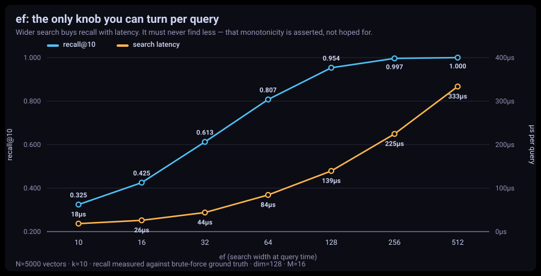

`ef` is the search width, the one parameter you can change per query. At 5,000
vectors of 128 dimensions it spans **0.325 recall at 18 µs** to **1.000 at
334 µs**. The suite asserts the shape as well as the numbers: a wider search may
cost more, but it must never find *less*.

### Recall at a fixed `ef` falls as the corpus grows

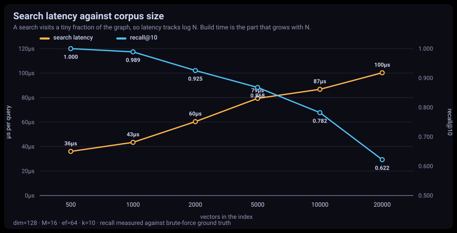

This is the most practically useful thing in this README. Hold `ef` at 64 and
recall slides from 1.000 at 500 vectors to **0.622 at 20,000** — not because the
index degrades, but because a fixed-width beam covers a shrinking share of a
growing space. **`ef` has to grow with `N`.** That it is a `Search` argument
rather than a build-time constant is the whole point.

Latency, meanwhile, grows **2.8× for a 40× corpus** — the sub-linear behaviour
the index exists for. (Even that overstates it: past ~4 MB of vectors the
distance kernels start paying for memory rather than arithmetic, so the measured
curve is nearer `sqrt(N)` than the `log(N)` the algorithm implies.)

### Dimension costs recall and latency at both ends

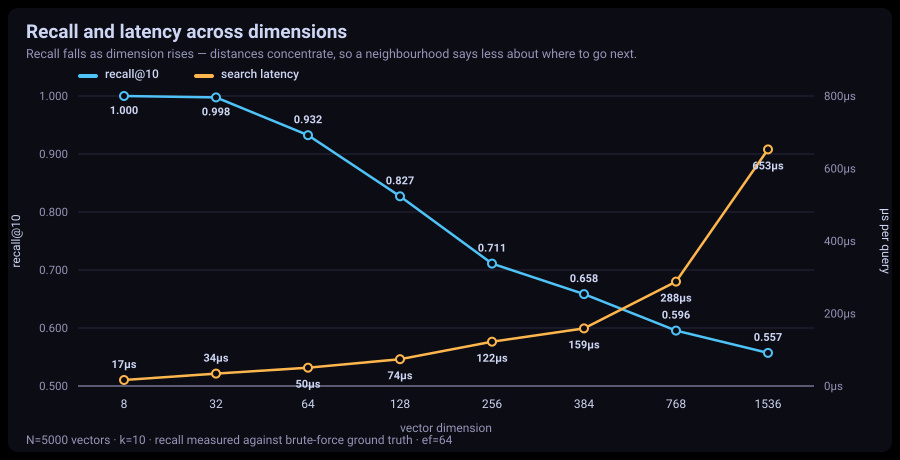

At `ef=64`, recall runs from 1.000 at 8 dimensions to **0.557 at 1536** while a
query goes from 17 µs to 653 µs. High-dimensional embeddings need a wider `ef`,
and the build cost rises with them: the same corpus takes 0.46 s to index at 8
dimensions and 27 s at 1536.

### `M` is structural — read this chart before you build

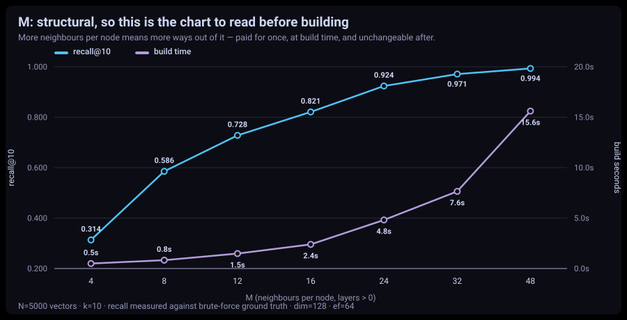

`M` cannot be changed without rebuilding, and it buys recall at a steep build
price: **M=4 gives 0.314 recall for a 0.5 s build; M=48 gives 0.994 for 16 s.**
The default of 16 sits where the curve turns.

### Choosing `M` and `ef` together

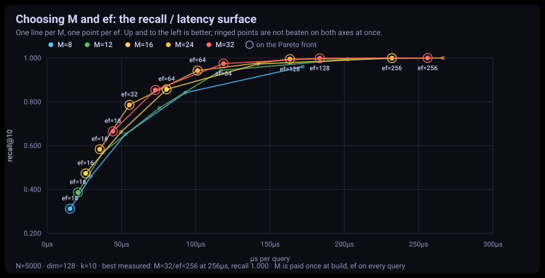

The two charts above each vary one knob with the other at its default, which
shows a slope but cannot answer *"which pair?"* — "M=16 gives 0.821" really means
"M=16 *at a narrow ef*". This is the surface: one line per `M`, one point per
`ef`, ringed where nothing beats that point on both axes at once.

Compared at **equal recall**, raising `M` is worth less than the M-chart alone
suggests:

| Target | via `ef` (M=16) | via `M` (ef=64/128) | Build cost |
|---|---|---|---|
| ~0.97 | ef=128 → 0.973, **142 µs** | M=32/ef=64 → 0.975, **119 µs** | 2.4 s → 7.6 s |
| ~0.999 | ef=256 → 1.000, **232 µs** | M=32/ef=128 → 0.999, **183 µs** | 2.4 s → 7.6 s |

**About 15–20% latency, for 3× the build time and roughly double the graph memory.**
That is a weaker case for raising `M` than comparing the two 1-D charts
implies — which is exactly why the 2-D grid is the one to read. `M=16` is a good
default; reach for `M=24`–`32` only when query latency is the binding constraint
and you can afford the build.

### Picking `ef` without a benchmark: `SuggestedEf`

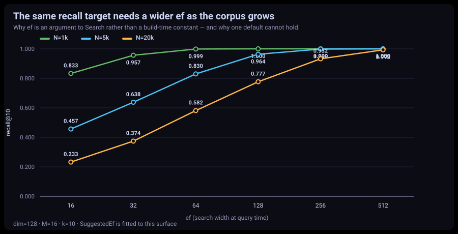

Holding a recall target needs a wider search as the corpus grows — measured,
`ef` scales as roughly **n^0.78**. That relationship is fitted into the API so
the guidance lives where it is used:

```go
// Ef left at zero: the width is chosen to clear TargetRecall (default 0.95).
matches, _ := db.Search(govecdb.SearchRequest{Query: query, K: 10, TargetRecall: 0.95})
```

`targetRecall` is a **floor to clear, not a point to hit** — the calibration
carries margin, so 0.95 measures 0.969 at 1,000 vectors and 0.972 at 5,000.
Calibrated exactly on the sweep it undershot on three of four verification
corpora, because recall on one corpus does not transfer precisely to another.

`k` and `M` enter too, measured rather than assumed: ef grows only as
**k^0.2** (a 100-candidate pool needs barely more width than a top-10), and
falls as **(16/M)^0.85**. `TestSuggestedEfAchievesTarget` builds real graphs at
k=10 and 100, M=16 and 32, and fails if a suggestion misses, so the constants
cannot rot quietly.

### And then the database measures its own data

No formula can know how hard *your* data is, and the spread is enormous. At
62,500 vectors and a 0.95 target, uniform random vectors at dimension 512 need
`ef ≈ 3,072`; tightly clustered ones at the same size need `ef ≈ 10`. So a
database calibrates itself: whenever its live count has doubled or halved, a
background goroutine searches for a sample of its own vectors — each with its
own node hidden from the traversal, as an un-inserted query would see the graph
— checks them against an exact scan, and scales every later suggestion to fit.

| 62,500 vectors unless noted, held-out queries | formula | calibrated |
|---|---|---|
| clustered, dim 512, k=10 | ef 1158 · 0.999 · 1.6 ms | **ef 15 · 0.978 · 49 µs** |
| clustered, dim 512, k=100 | ef 1835 · 1.000 · 2.6 ms | **ef 100 · 0.993 · 184 µs** |
| uniform, dim 128, k=10 | ef 1158 · 0.992 · 5.8 ms | ef 900 · 0.978 · 4.7 ms |
| uniform, dim 768, 20,000, k=10 | ef 476 · **0.817** | ef 1320 · **0.981** |

It narrows where the data is easy and widens where the formula undershoots.
It costs one exact scan of the sample — 45 ms at 62,500 × 512, around a second
at a million — outside any lock writers wait on. `Stats().EfScale` shows the
factor; `WithEfCalibration(false)` turns it off for reproducible widths, and
`db.Calibrate()` runs one now. An explicit `Ef` is never touched.

### Tombstones, and what `Compact()` gives back

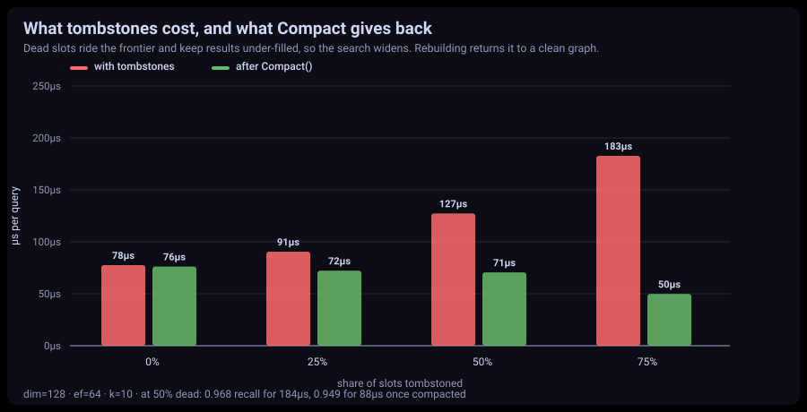

Dead slots ride the search frontier, so latency climbs with them — 78 µs clean,
**183 µs at 75% tombstoned**, back to **50 µs** after `Compact()`.

There is a subtlety worth knowing, because it looks like a regression and isn't:
compaction *slightly lowers* recall (0.978 → 0.955 at 50% dead). Tombstones keep
the result set under-filled, which loosens the pruning bound and makes the search
explore wider than `ef` asked for. That bought recall nobody requested at a
latency nobody wanted — 127 µs against 71 µs. A marginally larger `ef` on the
compacted graph recovers the recall and is still twice as fast.

### Filtering costs search width, not allocations

A metadata filter is applied while the graph is being walked, not to the results.
A rejected vector still rides the search frontier — it is often the bridge to one
that matches — but never enters the result set. That is what makes a filtered
search return `K` results instead of however many of the nearest `K` happened to
match: measured on a one-in-fifty filter, **10 results against 2** for the same
query post-filtered.

What it costs is travel. 10,000 × 128, `k=10`, `ef=64`:

| Admitted | none (unfiltered) | 1 in 2 | 1 in 10 | 1 in 50 |
|---|---|---|---|---|
| Latency | 66 µs | 131 µs | 346 µs | 812 µs |
| Allocs | **1** | **1** | **1** | **1** |

This is the same curve tombstones produce and the same mechanism: with fewer
admissible nodes the result set fills slowly, which loosens the pruning bound and
makes the search explore wider until it has `k`.

**The allocation count does not move**, which is the part worth defending — the
metadata lookup borrows the stored map rather than copying it, so the 1 alloc/op
search baseline survives filtering intact.

Past roughly one in a hundred the graph stops being the right tool: a scan over
the metadata, distance-checking only what matches, beats a traversal that is
visiting most of the graph anyway.

### Metric and data shape

| Metric | recall @ ef=64 | @ ef=256 | | Corpus | recall | latency |
|---|---|---|---|---|---|---|
| Cosine | 0.831 | 0.997 | | centered | 0.845 | 77 µs |
| Euclidean | 0.900 | 0.998 | | positive orthant | 0.891 | 77 µs |
| DotProduct | 0.854 | 0.997 | | clustered | 0.896 | 25 µs |

All three metrics behave alike — no metric is weak here, and a wide search
recovers every one of them, which is what rules out the graph rather than the
data being at fault. Clustered data, which is what real embeddings look like, is
**3× faster** to search than uniform noise.

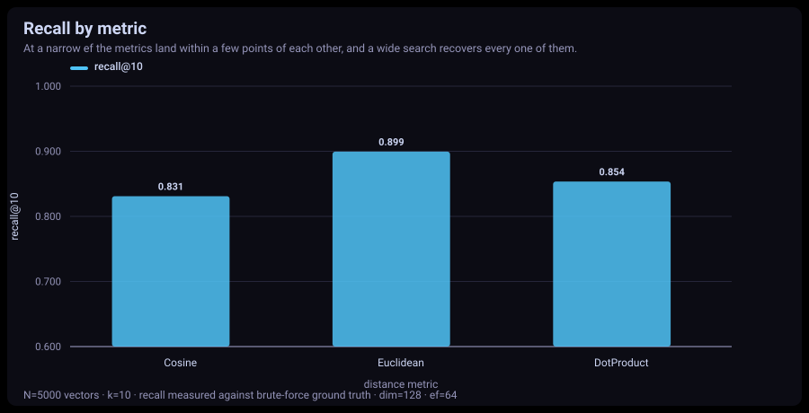

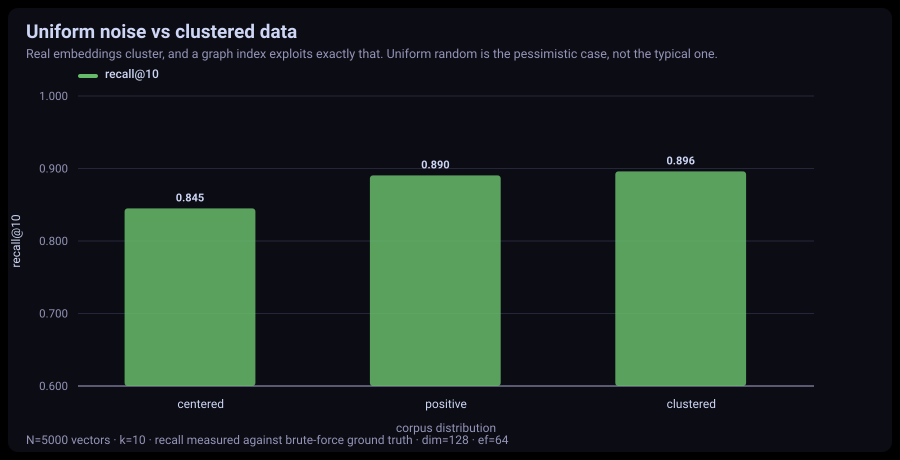

### Why `Alpha` defaults to 1.0, not DiskANN's 1.2

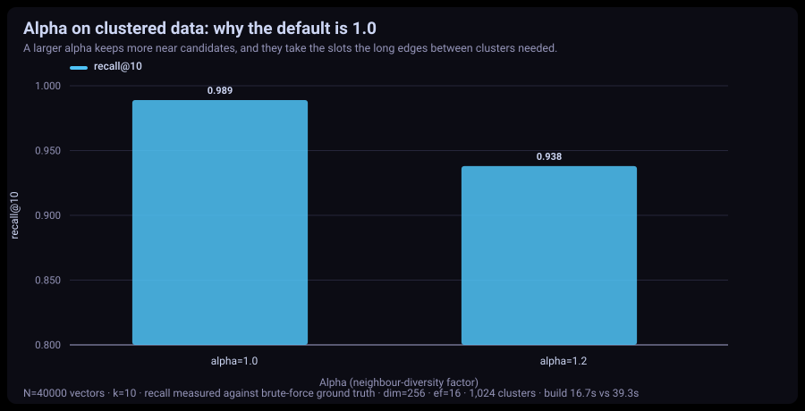

`Alpha` is the neighbour-diversity factor. A larger one keeps more near
candidates, and since they arrive nearest-first they take the slots that the
long edges between clusters needed. On 40,000 × 256 vectors in 1,024 clusters
at `ef=16`, alpha 1.0 reaches **0.989** recall against 1.2's **0.938**, and it
builds in **less than half the time** (16.7 s against 39.3 s). On uniform data
the two need the same `ef`. `TestSweepClusteredAlpha` guards this.

## Roadmap

1. ~~**HNSW index**~~ — done, from scratch, tested against brute force
2. ~~**Concurrent reads**~~ — done; pooled search scratch + `RWMutex`, parallel `Search`
3. ~~**Delete**~~ — done; tombstones that keep routing, filtered out of results
4. ~~**Upsert**~~ — done; `Insert` replaces an existing id, tombstoning the old slot
5. ~~**Compaction**~~ — done; `Compact()` rebuilds over the live vectors and swaps in
6. ~~**WAL**~~ — done; record format, append-only writer with segment rotation, and
   `Replay` — a CRC-validating scan that truncates torn tails
7. ~~**Snapshots**~~ — done; atomic checksummed store keyed by WAL sequence, plus
   a graph codec so recovery loads an index (~0.36 s/1M vectors) instead of
   rebuilding one (~506 s)
8. ~~**Public API**~~ — done; `Open` / `Add` / `Get` / `Search` / `Snapshot` /
   `Compact`, with restore-on-open and snapshot scheduling
9. ~~**WAL truncation**~~ — done; segments a snapshot has made redundant are
   deleted after each snapshot, against the *oldest retained* one
10. ~~**Metadata filtering**~~ — done; a query engine applied inside the traversal,
    so a filtered search still returns `K`

11. ~~**Collections**~~ — done in `service/`; many independent databases in one
    directory, loaded on demand and evicted when idle
12. ~~**REST server**~~ — done in `httpapi/` and `cmd/govecdbd`; `net/http` only,
    so the zero-dependency guarantee survives it
13. ~~**Observability**~~ — done; typed events through `WithObserver`, logged and
    counted by the daemon
14. ~~**Parallel batch build**~~ — done; `AddBatch` and log replay link on every
    core, ~11× at 16

**Next, in [dependency order](docs/MIGRATION.md#v2-scope):** online compaction,
fine-grained write locking, filter selectivity estimation, a quantized index,
then gRPC and clustering. Those last two land in a *separate
module*: neither gRPC nor Raft is stdlib, and this one keeps its guarantee. See
[the module decision](docs/SERVICE.md#the-module-decision), which was made before
the server was written rather than after.

## Running the tests and benchmarks

```bash
go build ./... && go vet ./... && go test ./...
```

The race detector is the gate before merging anything:

```bash
go test ./... -race
```

Per package, when you want the detail:

```bash
go test . -v                     # the public API
go test ./internal/hnsw/ -v      # the index
go test ./internal/wal/ -v       # the write-ahead log
go test ./internal/snapshot/ -v  # point-in-time state
go test ./internal/store/ -v     # metadata
go test ./internal/filter/ -v    # the metadata query engine
go test ./service/ -v            # collections
go test ./httpapi/ -v            # the REST layer
go test ./cmd/... -v             # the daemon, over a real socket
```

Benchmarks, including the filter-selectivity and durability numbers quoted above:

```bash
go test . ./internal/hnsw/ ./internal/wal/ ./internal/snapshot/ -run='^$' -bench=. -benchmem
```

Regenerating the charts. The sweeps *are* the benchmark harness — the same code
runs in CI asserting thresholds and, with `-results`, writes the CSV the charts
are drawn from, so a README number and a CI threshold cannot disagree:

```bash
go test ./internal/hnsw/ -run TestSweep -results docs/benchmarks/results.csv -timeout 40m
```

```bash
go run docs/benchmarks/plot.go
```

Two things that look like problems and are not. The sweeps **skip themselves
under `-race`** — they are single-goroutine, so the detector observes nothing
while costing ~10× and pushing the package past the default timeout; race
coverage lives in the `TestConcurrent*` tests instead. And the crash harness
(`internal/wal/crash_test.go`) re-executes the test binary as a child process and
`SIGKILL`s it, so seeing a child appear and die during `go test ./internal/wal/`
is the test working.

Requires Go 1.24+. The module has **zero third-party dependencies** — `go.mod` has
no `require` block, and there is no `go.sum`. Keep it that way.

## Contributing

See [CONTRIBUTING.md](CONTRIBUTING.md). For anything substantial, open an issue
first and check [the v2 scope](docs/MIGRATION.md#v2-scope) — much of what is
missing is already planned, in an order that matters.

## License

MIT — see [LICENSE](LICENSE).
